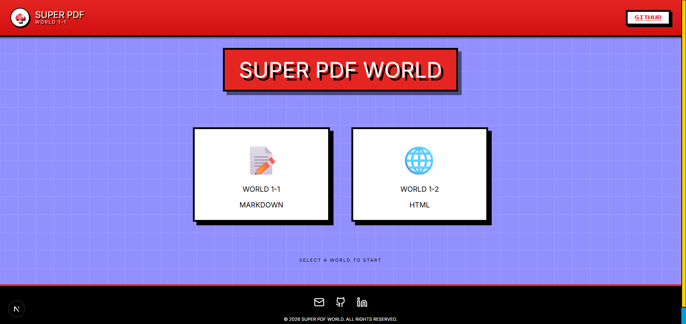
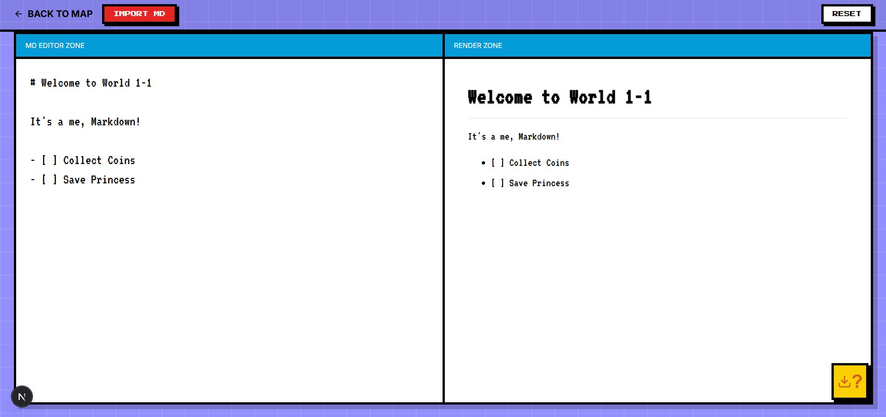
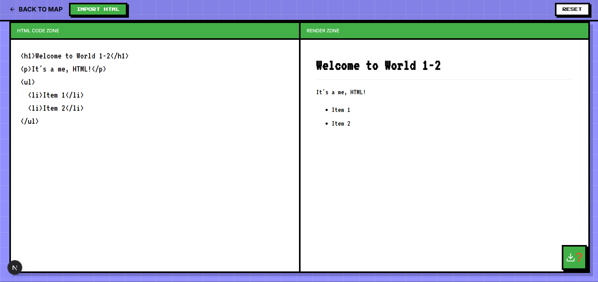

# Super PDF World

**Super PDF World** is a serverless, retro-themed web application that converts **Markdown** and **HTML** into high-quality PDFs. 
Built with **Next.js** and **Puppeteer**, it features a nostalgic Super Mario 8-bit aesthetic, live split-screen previews, and a serverless architecture designed for Vercel.

---

 

---

## Features

- **Dual Worlds**: 
  - **World 1-1**: Markdown Editor.
  - **World 1-2**: HTML Editor.
- **Live Preview**: See your rendered content in real-time.
- **Drag & Drop**: Simply drop `.md` or `.html` files to load them instantly.
- **Serverless PDF Generation**: Uses `puppeteer-core` and `@sparticuz/chromium-min` to generate high-fidelity PDFs within serverless function limits (50MB).
- **Retro Theme**: Fully styled with NES-inspired CSS, "Press Start 2P" fonts, and 8-bit animations.
- **Privacy Focused**: No data is stored. Documents are generated on-the-fly and immediately discarded.

---

 

---

 

---

## Tech Stack

- **Framework**: [Next.js 14+](https://nextjs.org/) (App Router)
- **Styling**: CSS Modules, Google Fonts (Press Start 2P, VT323)
- **PDF Engine**: [Puppeteer Core](https://pptr.dev/)
- **Serverless Chromium**: [@sparticuz/chromium-min](https://github.com/Sparticuz/chromium)
- **Markdown Parsing**: [react-markdown](https://github.com/remarkjs/react-markdown)
- **Icons**: [Lucide React](https://lucide.dev/)

---

## Getting Started

### Prerequisites
- Node.js 20+ installed.

### Installation

1.  **Clone the repository**:
    ```bash
    git clone https://github.com/AbdulAHAD968/markdown-to-pdf.git
    cd markdown-to-pdf
    ```

2.  **Install dependencies**:
    ```bash
    npm install
    ```

3.  **Run locally**:
    ```bash
    npm run dev
    Open [http://localhost:3000](http://localhost:3000).

> **Note**: In local development, the app uses your local Chrome installation. Ensure you have Chrome installed at the default path or update `app/api/pdf/route.js` if needed.

---

## Deployment

This project is optimized for **Vercel**.

1.  Push your code to GitHub.
2.  Import the project into Vercel.
3.  Deploy! (No environment variables required).

*The logic automatically switches between local Chrome (dev) and `@sparticuz/chromium-min` (production).*

---

## Privacy

This application is **stateless**.
- No files are saved to a database or storage bucket.
- Input content is sent to the serverless function, rendered to PDF, returned to the user, and then wiped from memory.
- No cookies or tracking scripts are used.

---

## Contact

Created by **Abdul Ahad**.

- **Email**: [ab.zarinc@gmail.com](mailto:ab.zarinc@gmail.com)
- **GitHub**: [@AbdulAHAD968](https://github.com/AbdulAHAD968)
- **LinkedIn**: [abdulahad-zarinc](https://www.linkedin.com/in/abdulahad-zarinc/)

---
*© 2026 Super PDF World. Power-up your documents!* 
